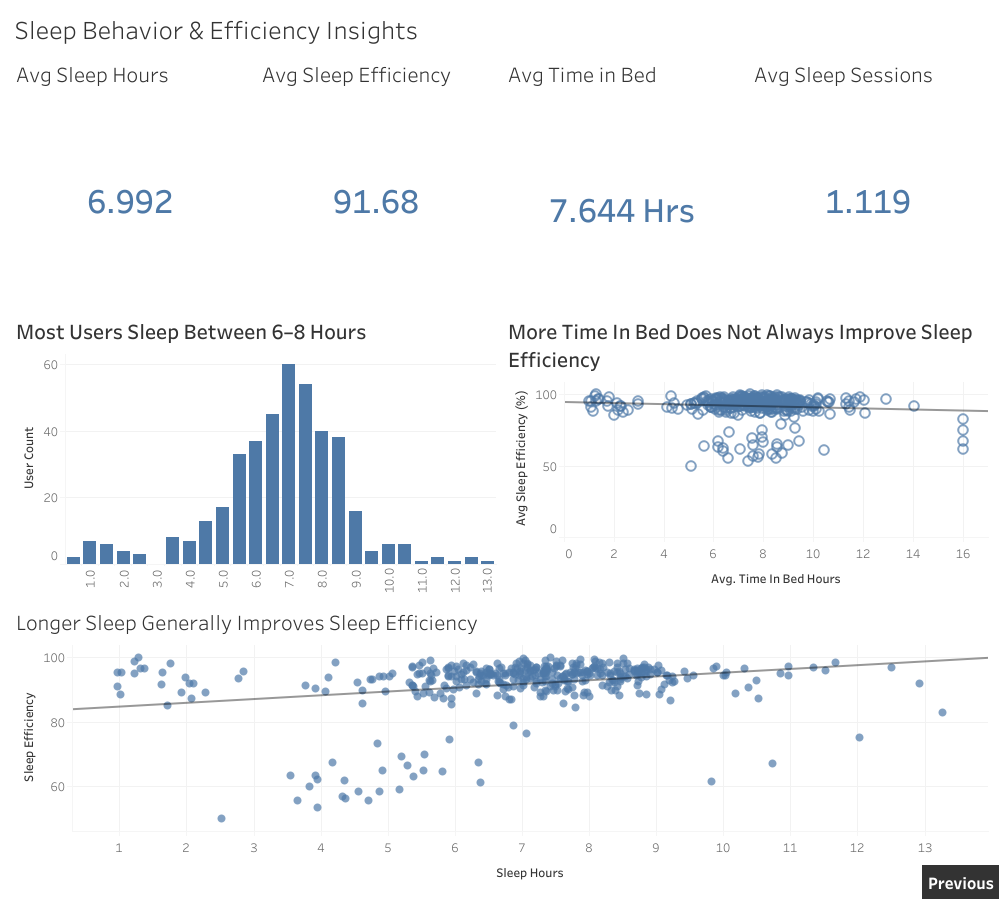

# Bellabeat Health & Behavioral Analytics

## Project Overview
This project analyzes Fitbit user behavior and wellness trends using the Bellabeat dataset. The objective was to identify activity, sleep, and behavioral patterns that can help improve user engagement and support smarter wellness recommendations.

---

## Business Task
Analyze smart device usage data to discover trends in user activity, sleep behavior, and exercise patterns that can support Bellabeat’s marketing and product strategy.

---

## Tools & Technologies
- SQL (BigQuery)
- Tableau Public
- Data Cleaning & Transformation
- Data Visualization
- Business Intelligence

---

## Dataset
- Bellabeat Fitbit Fitness Tracker Dataset
- Includes:
  - Daily activity
  - Hourly activity
  - Sleep tracking
  - Calories burned
  - Exercise intensity

---

## Dashboard Preview

---

## Dashboard Insights

### Dashboard 1 — User Activity Insights
- Users show peak activity during morning and evening hours
- Calories burned increase significantly during evening periods
- Exercise intensity is highest during evening hours

### Dashboard 2 — Behavioral Trends
- Most users average between 6–8 hours of sleep
- More time spent in bed does not always improve sleep efficiency
- Longer sleep duration generally improves sleep efficiency

### Dashboard 3 — Sleep & Wellness KPIs
- Average sleep efficiency remains above 90%
- Users demonstrate consistent sleep duration patterns
- Sleep quality varies despite similar time spent in bed

---

## Key Business Recommendations
- Target wellness notifications during peak activity hours
- Encourage consistent sleep routines
- Promote sleep-quality-focused features instead of longer bed time
- Personalize engagement based on user behavior patterns

---

## Skills Demonstrated
- SQL Querying
- Data Cleaning
- BigQuery
- Tableau Dashboarding
- Data Storytelling
- KPI Development
- Trend Analysis
- Business Recommendations

---

## Tableau Public Dashboard
Add your Tableau Public link here.

---

## Future Improvements
- Add predictive analytics
- Build user segmentation models
- Include geographic and demographic analysis
- Develop interactive filters for deeper insights
